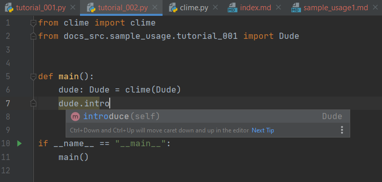
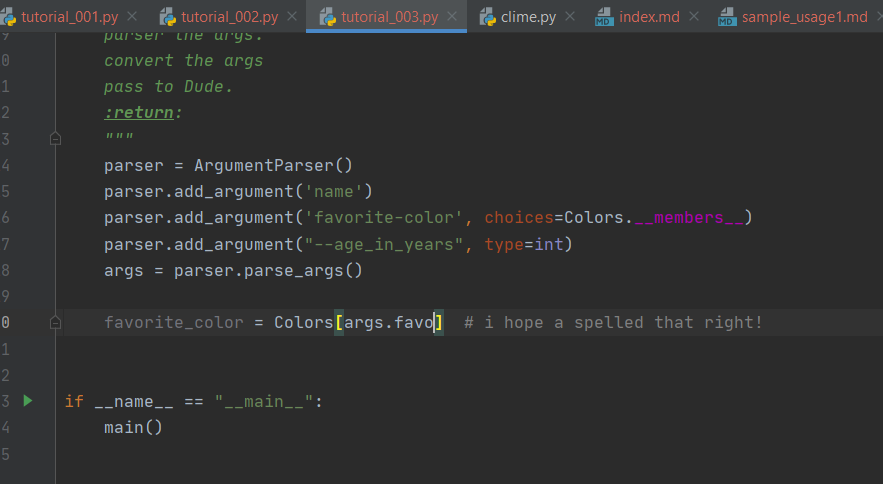

# Features

Say you wrote an amazing class like this:
```Python 
{!../docs_src/sample_usage/tutorial_001.py!}
```
Now you want to show it off to your friends. 
Which meand you are probably going to have make a CLI...

## Auto-generated, [Argparse](https://docs.python.org/3/library/argparse.html) based, CLIs from [attrs](https://www.attrs.org/en/stable/) classes in one function..
With CliMe, all you have to do is this:

```Python 
{!../docs_src/sample_usage/tutorial_002.py!}
```

Check it:
<div class="termy">

```console
$ python \docs_src\sample_usage\tutorial_002.py --help
usage:
    Everything about the Dude!


positional arguments:
  name                  type: <str>
  {Colors.red,Colors.blue}
                        type: <Colors>

optional arguments:
  -h, --help            show this help message and exit
  --age-in-years AGE_IN_YEARS
                        type: <int> (default: None)

```
</div>

##  No Duplicate code!
Making a custom ArgumentParser for Dude would look like this 
```Python 
{!../docs_src/sample_usage/tutorial_003.py!}
```
Note how much duplicate code CliMe saves you.
With CliMe, any changes to Dude's signature are automatically updated in the CLI!
 

## Code Completion!
Since CliMe returns an instance of your class, you IDE will be eager to help

Compare that to the Namespace returned by ArgumentParser.parser_args():



